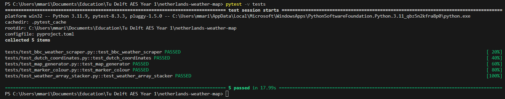

Student: Marginean Marius-Andrei 6031331

#Weather Map Generator

This program creates an interactive weather map of The Netherlands that shows the current temperature for a series of large cities while also providing a short description of the local weather conditions. 
The temperature values appear as numbers in the corresponding locations of the map. They are colour coded according to their value. Clicking on the numbers displays a pop up that contains the name of the city and a short description of the local weather conditions. The weather data is scraped form a series of links to the bbc weather website by using the beautiful soup python library. A separate function is used to determine the decimal coordinates of each respective city, by scraping the "https://www.geodatos.net/en/coordinates/netherlands/" website. All the data is processed, formated and arranged in a matrix with the use of another function. The map itself is constructed from the matrix using the folium library and saved as an html file that the user can interact with by running separately. 

The input to the entire program is an array of "https://www.bbc.com/weather/xxxxxxx" urls corresponding to cities in The Netherlands and the output is an html file that contains an interactive map with the current temperature and weather conditions in each city. In future versions, it is intended for the program to be able to display the weather in cities outside of the netherlands as well. It would also be prefered for the future input to be a list of city names, from which the urls can be generated. However, this proved difficult because bbc weather pages are indexed by a specific id number, not by city name. 

#How to run?

In order to run this program you need to have python intalled, download the repository into a folder and then use:
'''bash
weather_scraper.py
'''
A list of suitable urls has already been provided so the map of the current weather should be generated in the netherlands-weather-map folder. It will appear under the name "netherlands_weather_map.html". To interact with this file, you need to open it in a browser from the folder. If you want to change the cities on the map, you can change the urls in the file weather_scraper.py, in the variable url_list to any other valid bbc weather urls of the indicated format and run the program using the same procedure. 

Example : 
Input: 
url_list=["https://www.bbc.com/weather/2759794","https://www.bbc.com/weather/2755003","https://www.bbc.com/weather/2747373","https://www.bbc.com/weather/2745912",'https://www.bbc.com/weather/2743477','https://www.bbc.com/weather/2755420','https://www.bbc.com/weather/2759706','https://www.bbc.com/weather/2755251','https://www.bbc.com/weather/2751738','https://www.bbc.com/weather/2757220','https://www.bbc.com/weather/2756136']

Output : 

